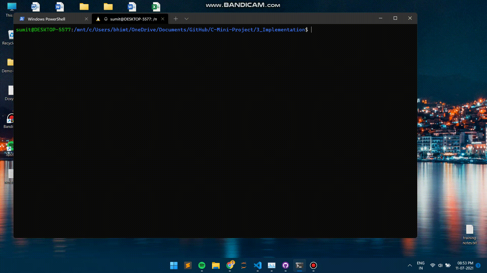

# LTTS MINI PROJECT - > Bank Management System

* This Project includes Financial application(Bank System) works on Command Line Interface(CLI).
* In this project I tried to show the working of a banking account system and cover the basic functionality of a Bank Account Management System.
* Through this bank management system user can manage all bank account activity like add account, view details, deposit money, withdraw money and any more.
* There is also a video which shows the total application so you can understand how it runs in 6_ImagesAndVideos Folder.

# Badges

Build | Code Quality | Unit Testing | [Git Inspector](github.io option) | Code Coverage
------|----------|-------|--------------|--------|
 |         |  |  | 

 

# How to use/run :-
After Downloading zip or Cloning Repository Go to 3_Implementation folder on linux or Windows terminal. and type the following commands.

* for compiling or executable type "make" command. which makes and Build folder.
* After writing "make" command type "make run" command for see its working or for execute a program.
* "make test" command for checking the unit test cases.
* "make clean" command to delete the Build Folder.

 

## Project Demo

 

## Folder Structure
Folder                | Description
----------------------| -----------------------------------------
`1_Requirements`      | Documents detailing requirements and research
`2_Architecture`      | Documents specifying design details
`3_Implementation`    | All code and documentation
`4_TestPlanAndOutput` | Documents with test plans and procedures
`5_Report`            | For marking or grading purpose  
`6_ImagesAndVideos`   | For showing working and for easily understanding
`7_Other`             | Used for Extra work on project for changing or modifying

 
 

## Contributors List and Summary

PS No. |  Name   |    Features    | Issuess Raised |Issues Resolved|No Test Cases|Test Case Pass
-------|---------|----------------|----------------|---------------|-------------|--------------
`302375` | Sumit Bhimte  | Feature A, B etc    | 0    | 0   |4   |4    

 
 

## Challenges Faced and How Was It Overcome
| No. | Challenge | Solution
|-----|-----------|--------
|1. | Accessing the text files which was in different directory | Given full extension while opening the file
|2. | Unit test Case handling | Used Unity framework
|3. | Woking on different OS Terminal | Used "Makfile" utility 
|4. | Error while Building the makefile | Trial and Error and referred Mini Project Template

 

## Learning Resources
1. [markdownCheatsheet](https://github.com/adam-p/markdown-here/wiki/Markdown-Cheatsheet)
2. [markdownBasics](https://guides.github.com/features/mastering-markdown/)
3. [git inspector](https://github.com/ejwa/gitinspector.git)
4. [github workflow](https://docs.github.com/en/actions/)

 

## SWOT Analysis

 

